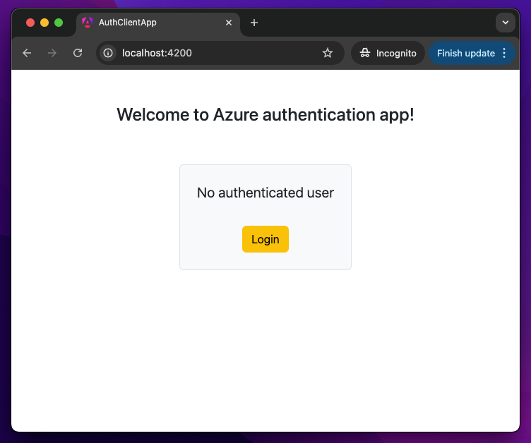
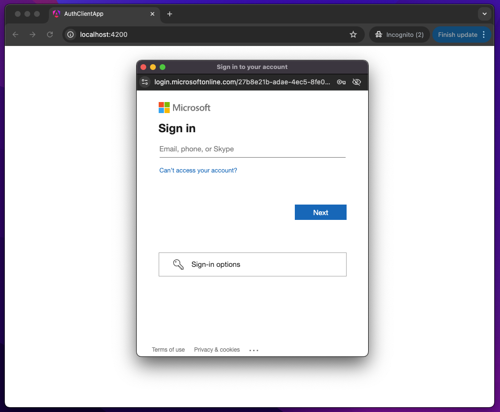
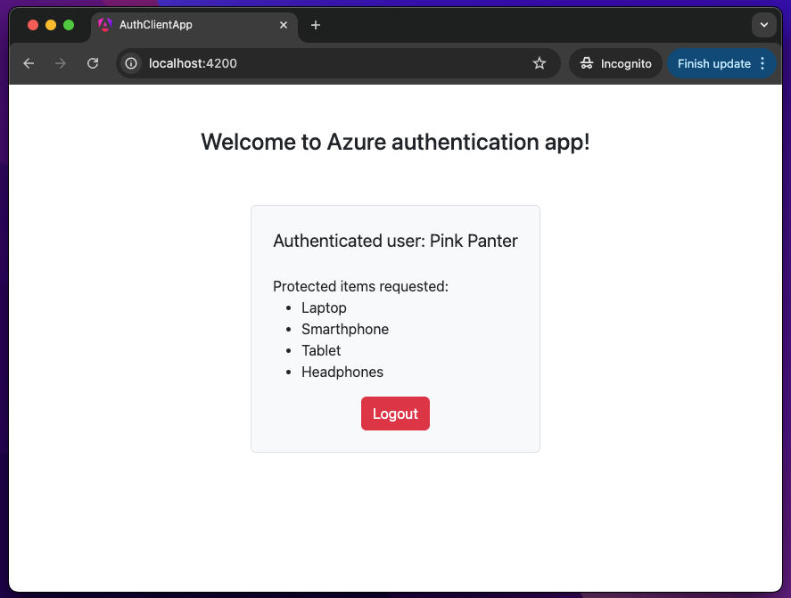

# Full-Stack Authentication with Azure Entra ID (Formerly Azure AD)

This repository demonstrates how to implement authentication and authorization for a full-stack application using Microsoft Entra ID (formerly Azure AD) with Angular (Frontend) and ASP.NET Core (Backend). The project covers how to securely authenticate users and authorize access to protected resources.
This repository is used in this [Medium post](https://nodejs.org/).

## Overview

In this example, the Angular frontend app is configured to authenticate users via Microsoft Entra ID using the MSAL.js library, and it communicates with a protected ASP.NET Core Web API. The API requires JWT tokens for authentication and validates user permissions using Azure scopes.

By following the steps in this repository, you will learn how to:

- Set up Azure app registrations for both the client and API applications.
- Build a secure ASP.NET Core Web API that requires JWT authentication.
- Use Azure Entra ID to authenticate and authorize requests in an Angular application.
- Make authorized API requests from the frontend to the backend.

## Prerequisites

Before you begin, make sure you have the following installed on your local machine:

- [Node.js](https://nodejs.org/) (version 14.x or later)
- [Angular CLI](https://angular.io/cli) (for frontend)
- [.NET 9 SDK](https://dotnet.microsoft.com/download) (for backend)
- [Microsoft Entra ID](https://learn.microsoft.com/en-us/azure/active-directory/) (Azure AD) tenant
- An Azure subscription (for app registrations and authentication setup)


## Setup Instructions

### 1. Azure Setup

To authenticate users using Microsoft Entra ID, you need to create and configure Azure app registrations for both the frontend (Angular app) and backend (API app). Follow these steps:

1. **Create Azure App Registrations**:
   - Register your **frontend** and **API** apps in the [Azure portal](https://portal.azure.com).
   - Set up redirect URIs and define required API permissions (`Items.Read`) for the client applications.

2. **Add Scopes**:
   - Configure the required API permissions in Azure for your client app to request access to the backend API (`Items.Read`).

### 2. Backend (ASP.NET Core)

1. Clone the repository and navigate to the `auth-app-api` folder
2. Install necessary packages and dependencies for ASP.NET Core:
   ```bash
   dotnet restore
3. Configure your appsettings.json for Azure Entra ID integration, specifying your ClientID, TenantID, and other relevant details:
    ```json
    {
        "AzureAd": {
            "ClientId": "your-client-id",
            "TenantId": "your-tenant-id",
            "Instance": "https://login.microsoftonline.com",
            "Domain": "your-domain"
        }
    }
2. Run the backend API:
   ```bash
   dotnet run

### 3. Frontend (Angular)
1. Navigate to the `auth-app-client` folder
2. Install the required dependencies::
   ```bash
   npm install
3. Update the Azure authentication configuration in the auth-config.ts file with your Azure app details (such as clientId, tenantId, and redirectUri).
4. Run the Angular app:
    ```bash
    ng serve


### 4. Test the Authentication Flow
Once both the client and backend are running:

Open the Angular app in your browser at http://localhost:4200.
Click Login to authenticate via Microsoft Entra ID. After logging in, the application will display a list of items retrieved from the protected backend API.
If authentication or authorization fails, a 401 or 403 status code will be returned based on the user’s permissions.



